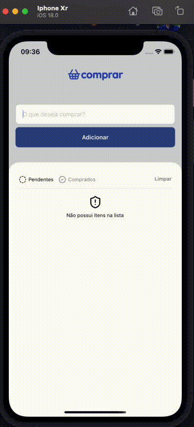

## ComprarApp

### Description 
This application can be used for shopping, it will save purchases on the local device, allowing the deletion of what is no longer needed, and filtering by Purchased and Pending.

### Goal
The main goal of these applications is improved our knowledge about react native with rocketseat school, state management, async storage and stylesheet

### Screenshot

### Tools
* expo: v53.0.9,
* expo-status-bar: v2.2.3,
* lucide-react-native: v0.511.0,
* react-native: v0.79.2,
* react-native-svg: v5.11.2,
* async-storage: v2.1.2

Josileudo Rodrigues - 2025

 
